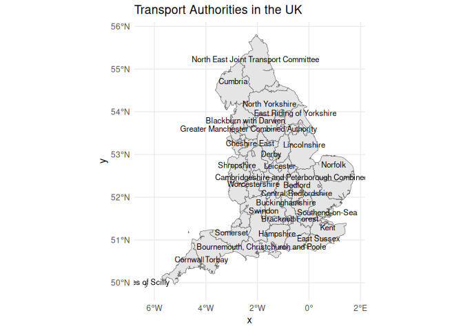
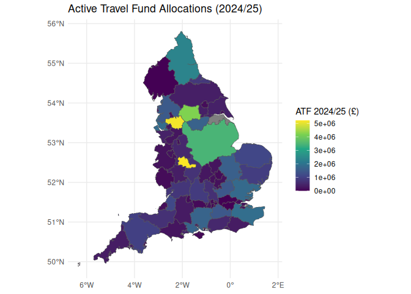
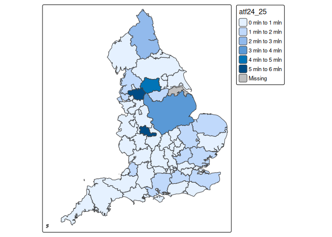
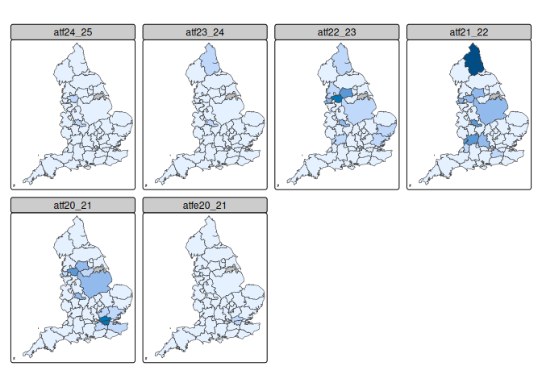
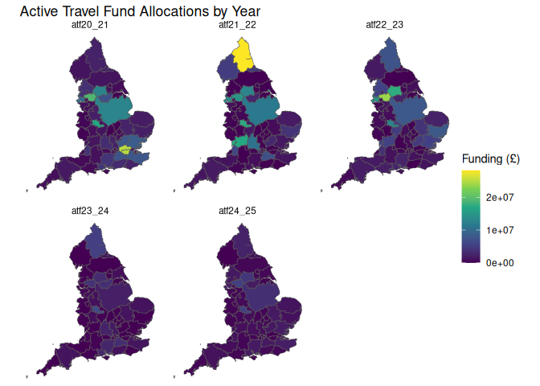
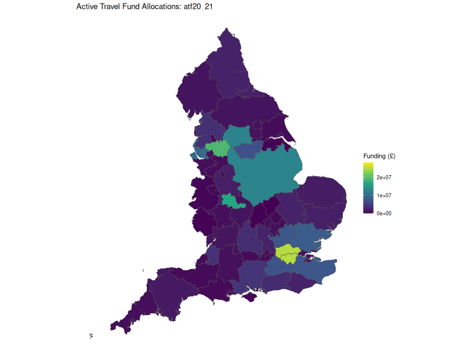

# Boundaries

See [regions.R](regions.R) for the code to download the boundaries.

``` r
pkgs = c("sf", "tidyverse", "ggrepel")
# Install packages if not already installed
new_pkgs = pkgs[!pkgs %in% installed.packages()[, "Package"]]
if(length(new_pkgs) > 0) {
  install.packages(new_pkgs)
}
for(pkg in pkgs) {
  library(pkg, character.only = TRUE)
}
```

``` r
transport_authorities = read_sf("transport_authorities_2025.geojson")
names(transport_authorities)
```

    [1] "name"     "geometry"

``` r
nrow(transport_authorities)
```

    [1] 73

``` r
# # # transport_authorities$name
#  [1] "Bedford"                                           
#  [2] "Blackburn with Darwen"                             
#  [3] "Blackpool"                                         
#  [4] "Bournemouth, Christchurch and Poole"               
#  [5] "Bracknell Forest"                                  
#  [6] "Brighton and Hove"                                 
#  [7] "Buckinghamshire"                                   
#  [8] "Cambridgeshire and Peterborough Combined Authority"
#  [9] "Central Bedfordshire"                              
# [10] "Cheshire East"                                     
# [11] "Cheshire West and Chester"                         
# [12] "Cornwall"                                          
# [13] "Cumbria"                                           
# [14] "Devon"                                             
# [15] "Dorset"                                            
# [16] "East Midlands Combined Authority"                  
# [17] "East Riding of Yorkshire"                          
# [18] "East Sussex"                                       
# [19] "Essex"                                             
# [20] "Gloucestershire"                                   
# [21] "Greater London"                                    
# [22] "Greater Manchester Combined Authority"             
# [23] "Hampshire"                                         
# [24] "Herefordshire"                                     
# [25] "Hertfordshire"                                     
# [26] "Isle of Wight"                                     
# [27] "Isles of Scilly"                                   
# [28] "Kent"                                              
# [29] "Kingston upon Hull"                                
# [30] "Lancashire"                                        
# [31] "Liverpool City Region Combined Authority"          
# [32] "Luton"                                             
# [33] "Medway"                                            
# [34] "Milton Keynes"                                     
# [35] "Norfolk"                                           
# [36] "North East Joint Transport Committee"              
# [37] "North East Lincolnshire"                           
# [38] "North Lincolnshire"                                
# [39] "North Northamptonshire"                            
# [40] "North Somerset"                                    
# [41] "North Yorkshire"                                   
# [42] "Oxfordshire"                                       
# [43] "Plymouth"                                          
# [44] "Portsmouth"                                        
# [45] "Reading"                                           
# [46] "Shropshire"                                        
# [47] "Slough"                                            
# [48] "Somerset"                                          
# [49] "South Yorkshire Combined Authority"                
# [50] "Southampton"                                       
# [51] "Southend-on-Sea"                                   
# [52] "Staffordshire"                                     
# [53] "Stoke-on-Trent"                                    
# [54] "Suffolk"                                           
# [55] "Surrey"                                            
# [56] "Swindon"                                           
# [57] "Tees Valley Combined Authority"                    
# [58] "Telford and Wrekin"                                
# [59] "Thurrock"                                          
# [60] "Torbay"                                            
# [61] "Warrington"                                        
# [62] "Warwickshire"                                      
# [63] "West Berkshire"                                    
# [64] "West Midlands ITA"                                 
# [65] "West Northamptonshire"                             
# [66] "West Sussex"                                       
# [67] "West Yorkshire Combined Authority"                 
# [68] "West of England Combined Authority"                
# [69] "Wiltshire"                                         
# [70] "Windsor and Maidenhead"                            
# [71] "Wokingham"                                         
# [72] "Worcestershire"                                    
# [73] "York"   
# ggplot2 with ggrepel for name labels
ggplot(transport_authorities) +
  geom_sf() +
  geom_sf_text(aes(label = name), size = 3, nudge_y = 0.1, check_overlap = TRUE) +
  theme_minimal() +
  labs(title = "Transport Authorities in the UK")
```



# Joining the boundaries to funding data

``` r
u = "https://www.gov.uk/government/publications/emergency-active-travel-fund-local-transport-authority-allocations/emergency-active-travel-fund-total-indicative-allocations"
# Code to download the html and extract the table
library(rvest)
html_content = rvest::read_html(u)
# Extract the table
table_raw = html_content |>
  html_node("table") |>
  html_table()
names(table_raw)
```

    [1] "Local Authority name"                                        
    [2] "Active Travel Fund 5 (2024/25) (£)"                          
    [3] "Active Travel Fund 4 extension (2023/24) (£)"                
    [4] "Active Travel Fund 4 (2022/23) (£)"                          
    [5] "Active Travel Fund 3 (2021/22), including change control (£)"
    [6] "Active Travel Fund 2 (2020/21) (£)"                          
    [7] "Emergency Active Travel Fund (2020/21) (£)"                  

``` r
# [1] "Local Authority name"                                        
# [2] "Active Travel Fund 5 (2024/25) (£)"                          
# [3] "Active Travel Fund 4 extension (2023/24) (£)"                
# [4] "Active Travel Fund 4 (2022/23) (£)"                          
# [5] "Active Travel Fund 3 (2021/22), including change control (£)"
# [6] "Active Travel Fund 2 (2020/21) (£)"                          
# [7] "Emergency Active Travel Fund (2020/21) (£)" 
names_clean = c("name_atf", "atf24_25", "atf23_24", "atf22_23", "atf21_22", "atf20_21", "atfe20_21")
atf_table = table_raw |>
  setNames(names_clean)
head(atf_table)
```

    # A tibble: 6 × 7
      name_atf                atf24_25 atf23_24 atf22_23 atf21_22 atf20_21 atfe20_21
      <chr>                   <chr>    <chr>    <chr>    <chr>    <chr>    <chr>    
    1 Bedford Unitary Author… 110,977  Not app… 263,130  n/a      363,750  30,250   
    2 Blackburn with Darwen … 185,106  n/a      157,270  n/a      292,600  77,000   
    3 Blackpool Unitary Auth… 84,208   n/a      n/a      n/a      312,000  26,000   
    4 Bournemouth, Christchu… 478,063  n/a      3,780,0… 208,947  1,062,1… 312,835  
    5 Bracknell Forest Unita… 74,781   75,000   30,000   n/a      181,800  57,000   
    6 Brighton & Hove Unitar… 330,173  n/a      3,000,0… 1,416,9… 2,376,0… 663,657  

``` r
# # A tibble: 6 × 7
#   name_atf                   atf24_25 atf23_24 atf22_23 atf21_22 atf20_21 atf20_21
#   <chr>                  <chr>      <chr>    <chr>    <chr>    <chr>    <chr>   
# 1 Bedford Unitary Autho… 110,977    Not app… 263,130  n/a      363,750  30,250  
# 2 Blackburn with Darwen… 185,106    n/a      157,270  n/a      292,600  77,000  
# 3 Blackpool Unitary Aut… 84,208     n/a      n/a      n/a      312,000  26,000  
# 4 Bournemouth, Christch… 478,063    n/a      3,780,0… 208,947  1,062,1… 312,835 
# 5 Bracknell Forest Unit… 74,781     75,000   30,000   n/a      181,800  57,000  
# 6 Brighton & Hove Unita… 330,173    n/a      3,000,0… 1,416,9… 2,376,0… 663,657 
atf_table = atf_table |>
  mutate(across(starts_with("atf"), ~ as.numeric(gsub(",", "", .)))) |>
  mutate(name = str_replace_all(name_atf, " Unitary Authority", "")) |>
  mutate(name = str_replace_all(name, " County Council", "")) |>
  mutate(name = str_replace_all(name, " County Authority", "")) |>
  # Remove anything after [
  mutate(name = str_replace_all(name, "\\[.*\\]", ""))
matching_names = atf_table$name %in% transport_authorities$name
atf_table_not_matched = atf_table |>
  filter(!matching_names)
```

``` r
atf_table_not_matched |>
  select(name) |>
  arrange(name) |>
  pull(name)
```

     [1] "Bournemouth, Christchurch & Poole*"              
     [2] "Brighton & Hove"                                 
     [3] "Cambridgeshire & Peterborough Combined Authority"
     [4] "Cheshire West & Chester"                         
     [5] "City of York"                                    
     [6] "Cumberland Council"                              
     [7] "Derby"                                           
     [8] "Derbyshire"                                      
     [9] "East Midlands Combined"                          
    [10] "Greater Manchester Combined Authority*"          
    [11] "Kingston upon Hull*"                             
    [12] "Leicester"                                       
    [13] "Leicestershire"                                  
    [14] "Lincolnshire"                                    
    [15] "Liverpool City Region Combined Authority*"       
    [16] "London Boroughs and Transport for London"        
    [17] "North East Combined Authority"                   
    [18] "North Lincolnshire Council"                      
    [19] "North Northamptonshire Council"                  
    [20] "Northamptonshire"                                
    [21] "Nottingham"                                      
    [22] "Nottinghamshire"                                 
    [23] "Royal Borough of Windsor and Maidenhead"         
    [24] "Rutland"                                         
    [25] "Southend Unitary Council"                        
    [26] "Total"                                           
    [27] "West Midlands Combined Authority"                
    [28] "Westmorland and Furness Council"                 

``` r
#  [1] "Bournemouth, Christchurch & Poole*"              
#  [2] "Brighton & Hove"                                 
#  [3] "Cambridgeshire & Peterborough Combined Authority"
#  [4] "Cheshire West & Chester"                         
#  [5] "City of York"                                    
#  [6] "Cumberland Council"                              
#  [7] "Derby"                                           
#  [8] "Derbyshire"                                      
#  [9] "East Midlands Combined"                          
# [10] "Greater Manchester Combined Authority*"          
# [11] "Kingston upon Hull*"                             
# [12] "Leicester"                                       
# [13] "Leicestershire"                                  
# [14] "Lincolnshire"                                    
# [15] "Liverpool City Region Combined Authority*"       
# [16] "London Boroughs and Transport for London"        
# [17] "North East Combined Authority"                   
# [18] "North Lincolnshire Council"                      
# [19] "North Northamptonshire Council"                  
# [20] "Northamptonshire"                                
# [21] "Nottingham"                                      
# [22] "Nottinghamshire"                                 
# [23] "Royal Borough of Windsor and Maidenhead"         
# [24] "Rutland"                                         
# [25] "Southend Unitary Council"                        
# [26] "Total"                                           
# [27] "West Midlands Combined Authority"                
# [28] "Westmorland and Furness Council"  

# Search for non-matching names in the transport authorities
regx = "Bournemouth|Brighton|Cambridgeshire|Cheshire|York|Cumberland|East Midlands|Greater Manchester|Hull|Liverpool|London|North East|North Lincolnshire|Northamptonshire|Windsor and Maidenhead|Southend|West Midlands|East Midlands|Westmorland" 
transport_regions_matching = transport_authorities |>
    filter(str_detect(name, regx))
transport_regions_matching$name
```

     [1] "Bournemouth, Christchurch and Poole"               
     [2] "Brighton and Hove"                                 
     [3] "Cambridgeshire and Peterborough Combined Authority"
     [4] "Cheshire East"                                     
     [5] "Cheshire West and Chester"                         
     [6] "East Midlands Combined Authority"                  
     [7] "East Riding of Yorkshire"                          
     [8] "Greater London"                                    
     [9] "Greater Manchester Combined Authority"             
    [10] "Kingston upon Hull"                                
    [11] "Liverpool City Region Combined Authority"          
    [12] "North East Joint Transport Committee"              
    [13] "North East Lincolnshire"                           
    [14] "North Lincolnshire"                                
    [15] "North Northamptonshire"                            
    [16] "North Yorkshire"                                   
    [17] "South Yorkshire Combined Authority"                
    [18] "Southend-on-Sea"                                   
    [19] "West Midlands ITA"                                 
    [20] "West Northamptonshire"                             
    [21] "West Yorkshire Combined Authority"                 
    [22] "Windsor and Maidenhead"                            
    [23] "York"                                              

``` r
#  [1] "Bournemouth, Christchurch and Poole"               
#  [2] "Brighton and Hove"                                 
#  [3] "Cambridgeshire and Peterborough Combined Authority"
#  [4] "Cheshire East"                                     
#  [5] "Cheshire West and Chester"                         
#  [6] "East Midlands Combined Authority"                  
#  [7] "East Riding of Yorkshire"                          
#  [8] "Greater London"                                    
#  [9] "Greater Manchester Combined Authority"             
# [10] "Kingston upon Hull"                                
# [11] "Liverpool City Region Combined Authority"          
# [12] "North East Joint Transport Committee"              
# [13] "North East Lincolnshire"                           
# [14] "North Lincolnshire"                                
# [15] "North Northamptonshire"                            
# [16] "North Yorkshire"                                   
# [17] "South Yorkshire Combined Authority"                
# [18] "Southend-on-Sea"                                   
# [19] "West Midlands ITA"                                 
# [20] "West Northamptonshire"                             
# [21] "West Yorkshire Combined Authority"                 
# [22] "Windsor and Maidenhead"                            
# [23] "York"                   
atf_table$name
```

     [1] "Bedford"                                         
     [2] "Blackburn with Darwen"                           
     [3] "Blackpool"                                       
     [4] "Bournemouth, Christchurch & Poole*"              
     [5] "Bracknell Forest"                                
     [6] "Brighton & Hove"                                 
     [7] "Buckinghamshire"                                 
     [8] "Cambridgeshire & Peterborough Combined Authority"
     [9] "Central Bedfordshire"                            
    [10] "Cheshire East"                                   
    [11] "Cheshire West & Chester"                         
    [12] "Cornwall"                                        
    [13] "Cumberland Council"                              
    [14] "Cumbria"                                         
    [15] "Derby"                                           
    [16] "Derbyshire"                                      
    [17] "Devon"                                           
    [18] "Dorset"                                          
    [19] "East Midlands Combined"                          
    [20] "East Riding of Yorkshire"                        
    [21] "East Sussex"                                     
    [22] "Essex"                                           
    [23] "Gloucestershire"                                 
    [24] "Greater Manchester Combined Authority*"          
    [25] "Hampshire"                                       
    [26] "Herefordshire"                                   
    [27] "Hertfordshire"                                   
    [28] "Isle of Wight"                                   
    [29] "Isles of Scilly"                                 
    [30] "Kent"                                            
    [31] "Kingston upon Hull*"                             
    [32] "Lancashire"                                      
    [33] "Leicester"                                       
    [34] "Leicestershire"                                  
    [35] "Lincolnshire"                                    
    [36] "Liverpool City Region Combined Authority*"       
    [37] "London Boroughs and Transport for London"        
    [38] "Luton"                                           
    [39] "Medway"                                          
    [40] "Milton Keynes"                                   
    [41] "Norfolk"                                         
    [42] "North East Combined Authority"                   
    [43] "North East Lincolnshire"                         
    [44] "North Lincolnshire Council"                      
    [45] "North Northamptonshire Council"                  
    [46] "North Somerset"                                  
    [47] "North Yorkshire"                                 
    [48] "Northamptonshire"                                
    [49] "Nottingham"                                      
    [50] "Nottinghamshire"                                 
    [51] "Oxfordshire"                                     
    [52] "Plymouth"                                        
    [53] "Portsmouth"                                      
    [54] "Reading"                                         
    [55] "Rutland"                                         
    [56] "Shropshire"                                      
    [57] "Slough"                                          
    [58] "Somerset"                                        
    [59] "Southampton"                                     
    [60] "Southend Unitary Council"                        
    [61] "South Yorkshire Combined Authority"              
    [62] "Staffordshire"                                   
    [63] "Stoke-on-Trent"                                  
    [64] "Suffolk"                                         
    [65] "Surrey"                                          
    [66] "Swindon"                                         
    [67] "Tees Valley Combined Authority"                  
    [68] "Telford and Wrekin"                              
    [69] "Thurrock"                                        
    [70] "Torbay"                                          
    [71] "Warrington"                                      
    [72] "Warwickshire"                                    
    [73] "West Berkshire"                                  
    [74] "West Midlands Combined Authority"                
    [75] "Westmorland and Furness Council"                 
    [76] "West Northamptonshire"                           
    [77] "West of England Combined Authority"              
    [78] "West Sussex"                                     
    [79] "West Yorkshire Combined Authority"               
    [80] "Wiltshire"                                       
    [81] "Royal Borough of Windsor and Maidenhead"         
    [82] "Wokingham"                                       
    [83] "Worcestershire"                                  
    [84] "City of York"                                    
    [85] "Total"                                           

``` r
atf_table = atf_table |>
  mutate(name = case_when(
    name == "Bournemouth, Christchurch & Poole*" ~ "Bournemouth, Christchurch and Poole",
    name == "Brighton & Hove" ~ "Brighton and Hove",
    name == "Cambridgeshire & Peterborough Combined Authority" ~ "Cambridgeshire and Peterborough Combined Authority",
    name == "Cheshire West & Chester" ~ "Cheshire West and Chester",
    name == "City of York" ~ "York",
    name == "Cumberland Council" ~ "Cumberland",
    name == "East Midlands Combined" ~ "East Midlands Combined Authority",
    name == "Greater Manchester Combined Authority*" ~ "Greater Manchester Combined Authority",
    name == "Kingston upon Hull*" ~ "Kingston upon Hull",
    name == "Liverpool City Region Combined Authority*" ~ "Liverpool City Region Combined Authority",
    name == "London Boroughs and Transport for London" ~ "Greater London",
    name == "North East Combined Authority" ~ "North East Joint Transport Committee",
    name == "North Lincolnshire Council" ~ "North Lincolnshire",
    name == "North Northamptonshire Council" ~ "North Northamptonshire",
    name == "Northamptonshire" ~ "Northamptonshire",
    name == "Royal Borough of Windsor and Maidenhead" ~ "Windsor and Maidenhead",
    name == "Southend Unitary Council" ~ "Southend-on-Sea",
    name == "West Midlands Combined Authority" ~ "West Midlands ITA",
    name == "Westmorland and Furness Council" ~ "Westmorland and Furness",
    TRUE ~ name
  ))
atf_table$name
```

     [1] "Bedford"                                           
     [2] "Blackburn with Darwen"                             
     [3] "Blackpool"                                         
     [4] "Bournemouth, Christchurch and Poole"               
     [5] "Bracknell Forest"                                  
     [6] "Brighton and Hove"                                 
     [7] "Buckinghamshire"                                   
     [8] "Cambridgeshire and Peterborough Combined Authority"
     [9] "Central Bedfordshire"                              
    [10] "Cheshire East"                                     
    [11] "Cheshire West and Chester"                         
    [12] "Cornwall"                                          
    [13] "Cumberland"                                        
    [14] "Cumbria"                                           
    [15] "Derby"                                             
    [16] "Derbyshire"                                        
    [17] "Devon"                                             
    [18] "Dorset"                                            
    [19] "East Midlands Combined Authority"                  
    [20] "East Riding of Yorkshire"                          
    [21] "East Sussex"                                       
    [22] "Essex"                                             
    [23] "Gloucestershire"                                   
    [24] "Greater Manchester Combined Authority"             
    [25] "Hampshire"                                         
    [26] "Herefordshire"                                     
    [27] "Hertfordshire"                                     
    [28] "Isle of Wight"                                     
    [29] "Isles of Scilly"                                   
    [30] "Kent"                                              
    [31] "Kingston upon Hull"                                
    [32] "Lancashire"                                        
    [33] "Leicester"                                         
    [34] "Leicestershire"                                    
    [35] "Lincolnshire"                                      
    [36] "Liverpool City Region Combined Authority"          
    [37] "Greater London"                                    
    [38] "Luton"                                             
    [39] "Medway"                                            
    [40] "Milton Keynes"                                     
    [41] "Norfolk"                                           
    [42] "North East Joint Transport Committee"              
    [43] "North East Lincolnshire"                           
    [44] "North Lincolnshire"                                
    [45] "North Northamptonshire"                            
    [46] "North Somerset"                                    
    [47] "North Yorkshire"                                   
    [48] "Northamptonshire"                                  
    [49] "Nottingham"                                        
    [50] "Nottinghamshire"                                   
    [51] "Oxfordshire"                                       
    [52] "Plymouth"                                          
    [53] "Portsmouth"                                        
    [54] "Reading"                                           
    [55] "Rutland"                                           
    [56] "Shropshire"                                        
    [57] "Slough"                                            
    [58] "Somerset"                                          
    [59] "Southampton"                                       
    [60] "Southend-on-Sea"                                   
    [61] "South Yorkshire Combined Authority"                
    [62] "Staffordshire"                                     
    [63] "Stoke-on-Trent"                                    
    [64] "Suffolk"                                           
    [65] "Surrey"                                            
    [66] "Swindon"                                           
    [67] "Tees Valley Combined Authority"                    
    [68] "Telford and Wrekin"                                
    [69] "Thurrock"                                          
    [70] "Torbay"                                            
    [71] "Warrington"                                        
    [72] "Warwickshire"                                      
    [73] "West Berkshire"                                    
    [74] "West Midlands ITA"                                 
    [75] "Westmorland and Furness"                           
    [76] "West Northamptonshire"                             
    [77] "West of England Combined Authority"                
    [78] "West Sussex"                                       
    [79] "West Yorkshire Combined Authority"                 
    [80] "Wiltshire"                                         
    [81] "Windsor and Maidenhead"                            
    [82] "Wokingham"                                         
    [83] "Worcestershire"                                    
    [84] "York"                                              
    [85] "Total"                                             

``` r
atf_table_aggregated = atf_table |>
  # rename las in east midlands
  mutate(name = case_when(
    str_detect(name, "Derb|Leic|Lincoln|Nottingham|Rutland") ~ "East Midlands Combined Authority",
    TRUE ~ name
  )) |>
  group_by(name) |>
  summarise(across(starts_with("atf"), \(x) sum(x, na.rm = TRUE)))
# check match again:
matching_names = atf_table_aggregated$name %in% transport_authorities$name
atf_table_not_matched = atf_table_aggregated |>
  filter(!matching_names)
atf_table_not_matched$name
```

    [1] "Cumberland"              "Northamptonshire"       
    [3] "Total"                   "Westmorland and Furness"

Now we’ll join the funding data to the boundaries:

``` r
atf_joined = transport_authorities |>
  left_join(atf_table_aggregated, by = c("name" = "name"))
ggplot() +
  geom_sf(data = atf_joined, aes(fill = atf24_25)) +
  scale_fill_viridis_c() +
  theme_minimal() +
  labs(title = "Active Travel Fund Allocations (2024/25)", fill = "ATF 2024/25 (£)")
```



``` r
# Save the joined data
sf::write_sf(atf_joined, "atf_joined_2025.geojson", delete_dsn = TRUE)
```

Now let’s present the data as an animated map:

``` r
library(tmap)
qtm(atf_joined, fill = "atf24_25")
```



``` r
atf_joined |>
  qtm(, fill = c("atf24_25", "atf23_24", "atf22_23", "atf21_22", "atf20_21", "atfe20_21")) +
  # Legend outside
  tm_facets(free.scales = FALSE) +
  tm_legend(show = FALSE)
```



``` r
# With ggplot2, first pivot_longer the data
atf_long = atf_joined |>
  pivot_longer(cols = starts_with("atf"), names_to = "year", values_to = "funding") |>
  # Combined atfe and atf20_21
  mutate(year = case_when(
    year == "atfe20_21" ~ "atf20_21",
    TRUE ~ year
    )) |>
  group_by(name, year) |>
  summarise(funding = sum(funding, na.rm = TRUE)) |>
  ungroup() 
g_facet = ggplot(atf_long) + 
    geom_sf(aes(fill = funding)) +
    scale_fill_viridis_c() +
    facet_wrap(~ year, ncol = 3) +
    theme_minimal() +
    labs(title = "Active Travel Fund Allocations by Year", fill = "Funding (£)") +
    theme(legend.position = "bottom") +
    theme_void() 
g_facet
```



``` r
library(gganimate)
gga = ggplot(atf_long) + 
    geom_sf(aes(fill = funding)) +
    scale_fill_viridis_c() +
    # No facet_wrap here, just overlap for animation
    theme_minimal() +
    labs(title = "Active Travel Fund Allocations by Year", fill = "Funding (£)") +
    theme(legend.position = "bottom") +
    theme_void() +
  transition_states(year, transition_length = 2, state_length = 1) +
  labs(title = "Active Travel Fund Allocations: {closest_state}", fill = "Funding (£)") +
  ease_aes('linear') +
  theme(legend.position = "bottom") +
  theme_void()
class(gga)
```

    [1] "gganim" "gg"     "ggplot"

``` r
# install.packages("gifski")
# All pngs in directory, now animate them
# library(gifski)
# animate(gga, nframes = 5, fps = 1, width = 800, height = 600, renderer = gifski_renderer("atf_allocations.gif"))
```



Next steps…

- Explore funding per person
- Explore funding per km of cycle lane
- Explore funding in relation to tools used and LCWIPs
